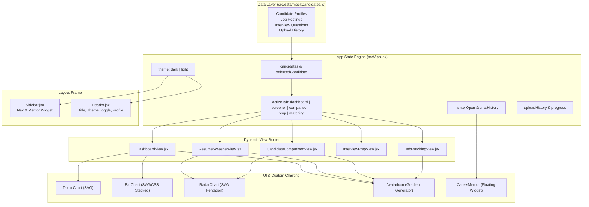

# 🚀 IntelliHire — AI-Powered Recruitment Platform

[](https://react.dev/)
[](https://vitejs.dev/)
[](https://oxc.rs/)
[](https://www.netlify.com/)
[](LICENSE)

**IntelliHire** is an enterprise-grade, AI-driven recruitment and talent intelligence platform designed to streamline talent acquisition, automated resume screening, ATS compatibility analysis, candidate comparison, and interview preparation. 

Built with **React 19** and **Vite 8**, IntelliHire provides recruiters and candidates with real-time skill-gap visualizers, personalized learning roadmaps, interactive interview evaluation suites, and an embedded AI Career Mentor chatbot — wrapped in a high-performance **Liquid Glassmorphism UI** with full Dark and Light mode support.

---

## 📋 Table of Contents

- [✨ Key Features & Modules](#-key-features--modules)
- [🏗️ System Architecture & Data Flow](#️-system-architecture--data-flow)
- [🛠️ Tech Stack & Tooling](#️-tech-stack--tooling)
- [📂 Project Directory Structure](#-project-directory-structure)
- [🧩 Component Breakdown & Specs](#-component-breakdown--specs)
- [📊 Data Schemas & Models](#-data-schemas--models)
- [🎨 Design System & UI/UX Features](#-design-system--uiux-features)
- [🚀 Quick Start & Local Setup](#-quick-start--local-setup)
- [🌐 Deployment & Build Setup](#-deployment--build-setup)
- [🔮 Future Roadmap](#-future-roadmap)
- [📄 License](#-license)

---

## ✨ Key Features & Modules

### 📊 1. Recruiter Dashboard (`DashboardView.jsx`)
- **Scanned Resumes Overview**: Real-time snapshot of scanned resumes (1,452 total) with candidate status indicators (`Screened`, `Shortlisted`).
- **Skill Distribution Analytics**: Donut chart showing candidate competency split across key technical domains (e.g., Python 35%, Java 25%, AWS 20%, Docker 20%).
- **Experience Trend Analysis**: Stacked bar chart visualizing candidate experience brackets (0–2 years, 2–5 years, 5+ years).
- **Candidate Ranking Table**: Ranked list of applicants with ATS compatibility scores, extracted skills tags, and live status dots.
- **Job Matching Detail Card**: Split layout linking position requirements (Senior AI Engineer) to candidate profiles with missing skills badges and learning resource links.

### 📄 2. Resume Screener & Skill-Gap Analysis (`ResumeScreenerView.jsx`)
- **Interactive File Uploader**: Simulated drag-and-drop file upload engine (PDF/DOCX) with progress bar tracking.
- **Upload History Drawer**: Toggleable recent uploads dropdown displaying ATS compatibility percentages and parsing statuses.
- **AI Resume Compatibility Score**: Detailed overall breakdown (e.g., 92% match) with automated text summaries.
- **Missing Keywords Detection**: Identifies critical keyword gaps (e.g., Kafka, Kubernetes) vs matched skills (AWS, Docker).
- **Skill-Gap Radar Chart**: Multi-axis radar visualization comparing candidate competencies against target job benchmarks.
- **Recommended Projects & Certifications**: Visual badges suggesting specific tools (PostgreSQL, Docker, VS Code) and credentials (AWS Cloud, CKAD, TensorRT, Kafka Dev).
- **Resume Versions Tracking**: Compares candidate CV revisions (`v1_draft.pdf`, `v2_experience.pdf`, `v3_final.pdf`) with ATS score diffs.

### ⚖️ 3. Candidate Comparison Analytics (`CandidateComparisonView.jsx`)
- **Dual Candidate Selectors**: Dropdown selectors for comparing any two candidates side-by-side.
- **Side-by-Side Metrics Grid**: Direct comparison of ATS scores, years of experience, professional summaries, extracted skill lists, and missing skill badges.
- **Overlay Skill Radar Chart**: Dual SVG polygon overlay comparing Candidate A (Solid Blue) against Candidate B (Dashed Pink).

### 🎯 4. Job Matching Analysis (`JobMatchingView.jsx`)
- **Job Role Specifications**: Dynamic selector for available job postings (*Senior AI Engineer*, *Fullstack Machine Learning Developer*) with role overviews and architectural implications.
- **Granular ATS Breakdown**: Subscore progress bars for Keyword Match, Formatting Quality, Grammar, Work Experience, and Project Impact.
- **AI Resume Strengths & Weaknesses**: Categorized bullet points highlighting candidate pros (✓) and cons (✗).
- **Personalized Learning Roadmaps**: Actionable career growth steps with external links to course providers (Udemy, Confluent, DeepLearning.ai, Docker, AWS).

### 💬 5. AI Career Mentor Chatbot (`CareerMentor.jsx`)
- **Floating Conversational Bot**: Collapsible AI assistant widget accessible across all views.
- **Context-Aware Query Engine**: Responds intelligently to inquiries about specific candidates (e.g. *Abhishek Singh*, *Dother Brahy*), top candidates, skill gaps (Kubernetes/Kafka advice), and general interview recommendations.
- **Real-Time UX**: Automatic smooth scrolling, user/mentor chat bubble distinction, timestamp tracking, and online status indicator.

### 💡 6. AI Interview Preparation Suite (`InterviewPrepView.jsx`)
- **Categorized Question Bank**: Practice questions categorized across **Technical**, **HR**, **Coding**, and **Behavioral** domains.
- **Key Points Checklist**: Hints for candidates on essential topics to include in their responses.
- **Interactive Answer Evaluator**: Live scoring engine analyzing user text input based on word count, technical depth, and structural framing.

---

## 🏗️ System Architecture & Data Flow



---

## 🛠️ Tech Stack & Tooling

| Layer | Technology | Description |
| :--- | :--- | :--- |
| **Frontend Library** | React 19 (`react`, `react-dom` v19.2.7) | Modern UI library utilizing hooks (`useState`, `useEffect`, `useRef`) |
| **Build System** | Vite 8 (`vite` v8.1.1, `@vitejs/plugin-react` v6.0.3) | Next-generation fast frontend bundler with HMR |
| **Code Quality** | Oxlint (`oxlint` v1.71.0) | High-performance Rust-based JavaScript/JSX linter |
| **Typography** | Google Fonts (`Outfit`, `Inter`) | Clean, modern typography pairing |
| **Data Viz** | Custom Native SVG Engine | Zero-dependency high-performance vector charting (`DonutChart`, `BarChart`, `RadarChart`) |
| **Styling** | Custom CSS3 Variables + Glassmorphic Effects | Liquid background blobs (`floatLiquid` keyframes), `backdrop-filter: blur(20px)`, dark/light themes |
| **Deployment** | Netlify | Automated CI/CD build configuration (`netlify.toml`) |

---

## 📂 Project Directory Structure

```
intellihire/
├── .github/                       # GitHub repository settings
├── dist/                          # Production build bundle output
│   ├── assets/                    # Compiled JavaScript & CSS bundles
│   ├── favicon.svg                # Application favicon
│   └── index.html                 # Build entry point
├── public/                        # Static assets
├── src/                           # Core source code
│   ├── assets/                    # Media assets (hero images, office background)
│   ├── components/                # React UI Components
│   │   ├── AvatarIcon.jsx         # Algorithmic gradient initials avatar component
│   │   ├── CandidateComparisonView.jsx # Side-by-side candidate comparison view
│   │   ├── CareerMentor.jsx       # Floating AI chatbot assistant component
│   │   ├── Charts.jsx             # Native SVG chart implementations (Donut, Bar, Radar)
│   │   ├── DashboardView.jsx      # Recruiter analytics & dashboard view
│   │   ├── Header.jsx             # Top bar header with theme switcher & profile
│   │   ├── InterviewPrepView.jsx  # AI interview practice & evaluation view
│   │   ├── JobMatchingView.jsx    # Candidate-to-job matching & roadmap view
│   │   ├── ResumeScreenerView.jsx # Resume screening & missing keywords view
│   │   └── Sidebar.jsx            # Main navigation sidebar
│   ├── data/                      # Data layer & initial state
│   │   └── mockCandidates.js      # Mock candidate profiles, jobs, interview Qs
│   ├── App.jsx                    # Root application component & state router
│   ├── main.jsx                   # React application mount entrypoint
│   └── index.css                  # Global styles, glassmorphism design system & themes
├── .gitignore                     # Git ignored files & directories
├── .oxlintrc.json                 # Oxlint linter settings
├── index.html                     # HTML head, title, SEO & Open Graph meta tags
├── netlify.toml                   # Netlify deployment & redirect settings
├── package.json                   # Project dependencies & npm scripts
├── package-lock.json              # Dependency tree lock file
├── README.md                      # Comprehensive project documentation
└── vite.config.js                 # Vite bundler configuration
```

---

## 🧩 Component Breakdown & Specs

| Component | Path | Responsibility |
| :--- | :--- | :--- |
| `App` | [`src/App.jsx`](file:///c:/Users/singh/.gemini/antigravity/scratch/intellihire/src/App.jsx) | Top-level state container; handles active tab switching, theme toggling, candidate selection state, upload history, and liquid background rendering. |
| `Sidebar` | [`src/components/Sidebar.jsx`](file:///c:/Users/singh/.gemini/antigravity/scratch/intellihire/src/components/Sidebar.jsx) | Renders navigation tabs, branding logo, and the AI Career Mentor trigger card with status preview. |
| `Header` | [`src/components/Header.jsx`](file:///c:/Users/singh/.gemini/antigravity/scratch/intellihire/src/components/Header.jsx) | Top header bar featuring mobile hamburger toggle, dynamic page titles, theme toggle button, notification indicators, and user profile avatar. |
| `DashboardView` | [`src/components/DashboardView.jsx`](file:///c:/Users/singh/.gemini/antigravity/scratch/intellihire/src/components/DashboardView.jsx) | Recruiter dashboard featuring scanned resume table, skill distribution donut chart, experience trend bar chart, candidate rankings table, and job alignment overview. |
| `ResumeScreenerView` | [`src/components/ResumeScreenerView.jsx`](file:///c:/Users/singh/.gemini/antigravity/scratch/intellihire/src/components/ResumeScreenerView.jsx) | Resume screening workspace with PDF upload simulator, upload history drawer, ATS score break-down, missing keyword highlight badges, radar skill visualization, recommended certs, and version tracking diffs. |
| `CandidateComparisonView` | [`src/components/CandidateComparisonView.jsx`](file:///c:/Users/singh/.gemini/antigravity/scratch/intellihire/src/components/CandidateComparisonView.jsx) | Dual-selector comparative workspace allowing side-by-side comparison of two candidates' metrics and dual-polygon SVG radar overlay. |
| `InterviewPrepView` | [`src/components/InterviewPrepView.jsx`](file:///c:/Users/singh/.gemini/antigravity/scratch/intellihire/src/components/InterviewPrepView.jsx) | Interactive interview practice environment supporting multiple question categories, candidate answer submissions, key points checklists, and instant score evaluation. |
| `JobMatchingView` | [`src/components/JobMatchingView.jsx`](file:///c:/Users/singh/.gemini/antigravity/scratch/intellihire/src/components/JobMatchingView.jsx) | Job vacancy specification viewer and candidate matching breakdown with subscores, strengths/weaknesses lists, and learning resource links. |
| `CareerMentor` | [`src/components/CareerMentor.jsx`](file:///c:/Users/singh/.gemini/antigravity/scratch/intellihire/src/components/CareerMentor.jsx) | Floating conversational AI assistant supporting live text input, auto-scrolling message streams, and automated candidate recommendation responses. |
| `Charts` | [`src/components/Charts.jsx`](file:///c:/Users/singh/.gemini/antigravity/scratch/intellihire/src/components/Charts.jsx) | Native SVG charting utilities: `DonutChart` (skills breakdown), `BarChart` (experience trend), and `RadarChart` (skill pentagon). |
| `AvatarIcon` | [`src/components/AvatarIcon.jsx`](file:///c:/Users/singh/.gemini/antigravity/scratch/intellihire/src/components/AvatarIcon.jsx) | Generates deterministic multi-colored gradient avatars with initials derived from candidate name string hash. |

---

## 📊 Data Schemas & Models

### 👤 Candidate Object Schema
```javascript
{
  id: "cand-1",
  name: "Abhishek Singh",
  role: "Senior AI Engineer",
  status: "Screened", // "Screened" | "Shortlisted"
  image: "https://images.unsplash.com/...",
  atsScore: 92,
  atsBreakdown: {
    overall: 92,
    keyword: 95,
    formatting: 88,
    grammar: 90,
    experience: 94,
    projects: 96
  },
  professionalSummary: [
    "Strong Backend & AI Developer",
    "6 years NLP & PyTorch Specialist",
    "React Frontend Expert"
  ],
  weaknesses: [
    "No Docker container optimization",
    "No Kubernetes cluster orchestration"
  ],
  extractedSkills: ["Python", "AWS", "Docker", "Machine Learning", "PyTorch"],
  missingSkills: ["Kubernetes", "Kafka", "RAG Systems"],
  experience: 6, // years
  experienceBreakdown: "6 years as AI researcher and team lead...",
  resumeMatchText: "Abhishek Singh is a senior-level AI Engineer...",
  roadmap: [
    {
      skill: "Kubernetes",
      recommendation: "Learn Kubernetes on Udemy...",
      url: "https://www.udemy.com/..."
    }
  ],
  skillsDistribution: { Java: 15, Python: 45, AWS: 20, Docker: 20 },
  versionHistory: [
    { version: "v3_final.pdf", date: "2026-07-10", score: 92, diff: "..." }
  ]
}
```

### 💼 Job Posting Object Schema
```javascript
{
  id: "job-1",
  title: "Senior AI Engineer",
  description: "Looking for an expert Senior AI Engineer to join our team...",
  implications: [
    "Deploy and manage models in containerized Kubernetes clusters.",
    "Integrate Kafka streaming data pipelines into inference systems."
  ]
}
```

### ❓ Interview Question Schema
```javascript
{
  id: "q-t1",
  question: "Explain the difference between data parallelism and model parallelism...",
  keyPoints: [
    "Model weights exceed GPU memory limit",
    "Batch size scaling limits",
    "Inter-GPU communication bottlenecks"
  ]
}
```

---

## 🎨 Design System & UI/UX Features

- **Liquid Glassmorphism Aesthetic**: Blurs card backgrounds (`backdrop-filter: blur(20px)`) with crisp 1px subtle borders (`rgba(255, 255, 255, 0.1)`).
- **Fluid Ambient Orbs**: Dynamic morphing liquid blobs created via CSS `@keyframes floatLiquid` that float and rotate behind interface components.
- **Dual Theme Support**: 
  - **Dark Mode (Default)**: Deep midnight navy background (`#0b0c10`) with glowing violet, blue, and emerald accents.
  - **Light Mode**: Crisp slate background (`#f8fafc`) with light glass cards and dark typography.
- **Zero Heavy Dependencies**: Built without heavyweight UI component libraries or bulky charting frameworks to ensure lightning-fast load times.
- **Fully Responsive Layout**: Integrated mobile drawer overlay, responsive grid collapsing, and scroll-safe containers.

---

## 🚀 Quick Start & Local Setup

### Prerequisites

Ensure you have Node.js and npm installed on your development machine:
- **Node.js**: `v18.0.0` or higher (Recommended: `v20.x`)
- **npm**: `v9.x` or higher (Recommended: `v10.x`)

### Installation Steps

1. **Clone the Repository**
   ```bash
   git clone https://github.com/abhi20042025/IntelliHire.git
   cd intellihire
   ```

2. **Install Dependencies**
   ```bash
   npm install
   ```

3. **Start Development Server**
   ```bash
   npm run dev
   ```
   The application will be running locally at `http://localhost:5173`.

4. **Lint Codebase with Oxlint**
   ```bash
   npm run lint
   ```

5. **Build for Production**
   ```bash
   npm run build
   ```

6. **Preview Production Build Locally**
   ```bash
   npm run preview
   ```

---

## 🌐 Deployment & Build Setup

IntelliHire is configured out-of-the-box for seamless single-page application (SPA) deployment on platforms like **Netlify** or **Vercel**.

### `netlify.toml` Configuration
```toml
[build]
  command = "npm run build"
  publish = "dist"

[build.environment]
  NODE_VERSION = "20"
  NPM_VERSION = "10"
  CI = "false"

[[redirects]]
  from = "/*"
  to = "/index.html"
  status = 200
```

---

## 🔮 Future Roadmap

- [ ] **Live AI Model Integration**: Connect backend to OpenAI GPT-4o or Google Gemini API for real-time resume parsing and dynamic interview feedback.
- [ ] **Real PDF/DOCX Document Parsing**: Integrate `pdfjs-dist` or `tesseract.js` for client-side text extraction from uploaded resume files.
- [ ] **Database & Authentication**: Connect Supabase or Firebase backend for multi-tenant recruiter accounts, persistent applicant tracking, and role-based access control (RBAC).
- [ ] **Export & Reporting Engine**: Enable downloadable candidate comparison reports in PDF and Excel formats.

---

## 📄 License

This project is licensed under the **MIT License** — see the [LICENSE](LICENSE) file for details.

---

<p center>
Made with ❤️ by <strong>Abhishek Singh</strong> & the IntelliHire Team.
</p>
